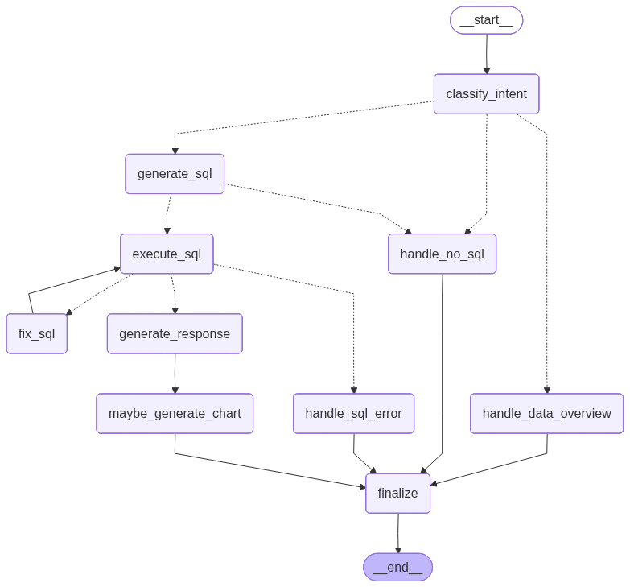
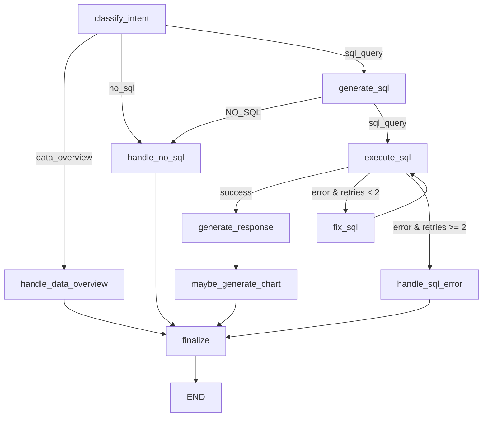

# LangGraph Chatbot State Machine Structure

This is the visual structure of the compiled LangGraph StateGraph, saved locally in the project repository.

## 1. Visual Graph Diagram (PNG)

Here is the graph image generated directly from the LangGraph runtime:

---

## 2. Mermaid Structure Definition

You can also render the diagram using this Mermaid block:

