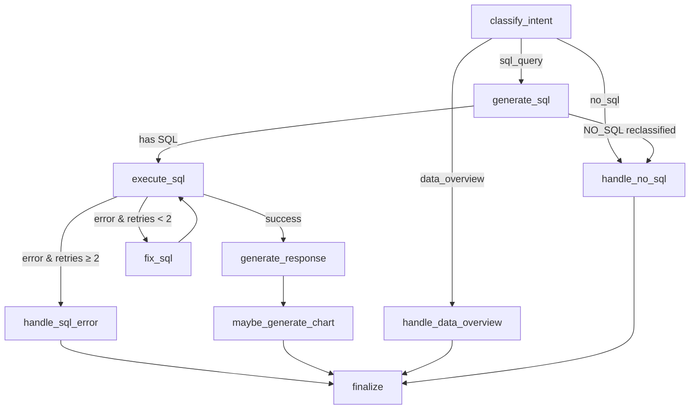

# Walkthrough: Agentic Pipeline, Combo Charts, and Responsiveness Updates

We have completed the major enhancements for the SQL ChatBot. Below is a breakdown of all features implemented, verified, and fixed.

---

## 1. LangGraph State Machine & Pydantic Validation

The fragile linear message processing was replaced with a robust **LangGraph StateGraph** featuring **Pydantic models** for validation.

### Flow Architecture

- **Type-safe transitions:** Graph state is strictly validated via Pydantic model shapes and TypedDict properties.
- **Self-Healing SQL:** If a SQL query fails execution (syntax or schema mismatches), the `fix_sql` node invokes a correction chain targeting the database schema up to 2 times.
- **Model Engine:** All pipeline tasks (Intent Classification, SQL Generation, Self-healing, and Summarization) run on the unified **Gemini 2.5 Flash** model for maximum speed and reasoning quality.

---

## 2. Expanded Interactive Chart Tools (12 Chart Types)

We added robust support for **5 new chart types**, bringing the total list of active chart tools to 12.

| Chart Tool | Type | Best For | ECharts Configuration |
|---|---|---|---|
| **`build_line_chart`** | Line | Continuous trends over time | Base line series |
| **`build_bar_chart`** | Horizontal Bar | Categorical comparisons (single metric) | Horizontal category axes |
| **`build_clustered_bar_chart`** | Clustered Bar | Comparing multiple metrics per group | Side-by-side bar series |
| **`build_pie_chart`** | Pie / Donut | Part-to-whole segment breakdown | Circular radial layout |
| **`build_scatter_chart`** | Scatter | Correlation between two numeric variables | Cartesian coordinate mapping |
| **`build_histogram_chart`** | Histogram | Frequencies across value ranges | Grouped interval bars |
| **`build_combo_chart`** | Combo | Mixed scales (columns + lines on dual y-axes) | Dual value y-axis mapping |
| **`build_area_chart`** | Area | Volume or accumulation trends over time | filled line series (`areaStyle: {opacity: 0.25}`) |
| **`build_stacked_bar_chart`** | Stacked Bar | Segment breakdowns within totals | Multi-value stacked series (`stack: 'total'`) |
| **`build_radar_chart`** | Radar | Multi-dimensional category profiles | Radar coordinate axis indicators |
| **`build_funnel_chart`** | Funnel | Progressive stage dropdowns/conversions | Inverted funnel values sorting |
| **`build_gauge_chart`** | Gauge | Single KPI dial representation relative to target | Gauge progress scale pointer |

### Chart Export Capabilities

All ECharts panels feature two distinct export buttons:
1. **Download PNG Button (Static Image):** Exports a high-resolution pixel image (best for documents, presentations, and static files).
2. **Download HTML Button (Interactive Chart):** Serializes the chart options into a self-contained local web page (best for saving fully dynamic interactive charts with tooltips and zoom scales that can be opened in any browser).

---

## 3. Phone and Tablet Responsiveness

Fixed layout lock-out issues and enabled text wrapping for smaller screen widths.

1. **Sidebar Lock-out Fix (Mobile):** Restored visibility to the floating open toggle button (`#sidebar-open-fab`) on mobile views when collapsed so users can slide reopen the sidebar drawer.
2. **Mobile Form Padding:** Scaled down padding on `≤ 600px` viewports to leave maximum typing area.
3. **Chip Wrapping:** Enabled suggestion chips to break words and wrap onto new lines (`white-space: normal !important;`) so long metric queries do not clip out of viewports.

---

## 4. Currency Conversion Fix (SQL & Response Paths)

Fixed an issue where currency conversions failed when requested on data queries. Previously, the chatbot only had access to exchange rates on non-database chitchat paths.
- **Fix:** Injected the live currency context (e.g. USD to UGX, EUR, etc.) directly into:
  1. The **SQL generation prompt** (so the LLM can construct queries doing math conversions like `* 3700`).
  2. The **response formatting prompt** (so the LLM can construct explanatory tables and summaries with conversions).

---

## Verification Logs

- **Import check:** `All imports OK`
- **Django diagnostics:** `System check identified no issues (0 silenced).`
- **Responsiveness transitions:** Tested resize hooks, side drawer toggles, and backdrop close listeners.
